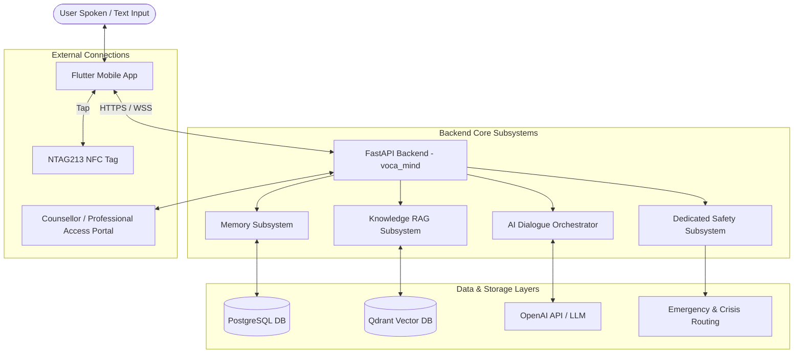

# Voca Mind (`voca-mind`)

> **Voice-based AI Emotional-Support and Mental-Health Companion**

---

## ⚠️ Important Product & Clinical Boundaries

**Voca Mind is NOT a medical device, clinical diagnostic tool, or licensed healthcare provider.**

- **No Medical Identity:** Voca Mind does NOT present itself as a doctor, psychiatrist, psychologist, or human therapist.
- **No Diagnostic Capabilities:** Voca Mind does NOT diagnose mental-health or medical conditions.
- **No Prescriptions:** Voca Mind does NOT prescribe, recommend, adjust, or comment on medication regimes.
- **No Treatment Decisions:** Voca Mind does NOT make clinical or treatment decisions on behalf of users or clinicians.
- **Scope:** Voca Mind provides empathetic, natural voice/text conversation, short-term supportive framing, and curated general educational mental-health information. All medical and treatment decisions remain exclusively with qualified human healthcare professionals.

---

## 🌟 Overview & Problem Statement

Millions of individuals experience daily stress, anxiety, emotional burnout, loneliness, and difficult life experiences without immediate access to an empathetic listener. While professional therapy is vital, there is a distinct need for an accessible, low-barrier emotional-support companion for everyday self-reflection, emotional processing, and psychoeducation.

**Voca Mind** addresses this gap by providing a natural, voice-first AI companion designed for users to speak openly about:
- Daily feelings and emotions
- Stress and anxiety management
- Worries, fears, and loneliness
- Challenging personal experiences
- General emotional wellness and coping strategies

---

## 💡 Major Features

1. **Natural Voice Interaction:** Low-latency Speech-to-Text (STT) and Text-to-Speech (TTS) integration enabling fluid, natural spoken dialogue.
2. **Curated Mental-Health RAG:** Knowledge-based Retrieval-Augmented Generation referencing approved educational materials (strictly separated from personal memory).
3. **Structured Memory Architecture:**
   - **Current Context:** Sliding window of active dialogue turns.
   - **Short-Term Memory:** Session state and immediate context buffers.
   - **Daily Summaries:** Neutral daily conversation summaries tracking themes, goals, and discussed coping strategies without diagnostic labels.
   - **User-Controlled Long-Term Memory:** Explicitly stored facts about user preferences and statements, fully viewable, editable, and deletable by the user.
4. **Independent Safety & Risk Subsystem:** A dedicated safety subsystem operating outside ordinary LLM prompting to detect risk signals (`LOW`, `CONCERN`, `HIGH_RISK`) and immediately prioritize crisis resources and human support for high-risk situations.
5. **Consent-Gated Professional Access:** Ability for users to explicitly share limited, audit-logged summaries or data packages with qualified counsellors or psychiatrists under strict user consent and time limits.
6. **Privacy-Preserving NFC Entry:** NTAG213 NFC tag integration for instant app launch via deep links, storing zero sensitive mental-health or personal data on the physical tag.

---

## 🛠️ Technology Stack

| Layer | Technology |
| :--- | :--- |
| **Mobile Frontend** | Flutter (iOS & Android) |
| **Backend API** | Python 3.11+, FastAPI (`voca_mind` package) |
| **Database & ORM** | PostgreSQL, SQLAlchemy (Async), Alembic |
| **Vector DB (RAG)** | Qdrant |
| **AI Orchestration** | OpenAI API (LLM & Embeddings) |
| **Authentication** | Firebase Authentication |
| **NFC Hardware** | NTAG213 Tags |
| **Containerization** | Docker & Docker Compose |
| **Version Control** | Git |

---

## 🏗️ High-Level Architecture Overview



---

## 📂 Repository Structure

```text
voca-mind/
├── frontend/          # Flutter mobile application codebase
├── backend/           # Python FastAPI application package (voca_mind)
├── knowledge_base/    # Curated mental-health documents & ingestion tools
├── scripts/           # Deployment, maintenance, and database migration scripts
├── docker/            # Dockerfiles and docker-compose configurations
├── docs/              # System architecture and technical design specifications
└── tests/             # End-to-end, unit, and integration tests
```

---

## 📊 Development Status

Current Phase: **Phase 1: Architecture and Documentation**

| Phase | Description | Status |
| :---: | :--- | :---: |
| **Phase 1** | Architecture & Documentation | 🔄 In Progress |
| **Phase 2** | Backend Foundation (`voca_mind`) | ⏳ Pending |
| **Phase 3** | Database & Migrations | ⏳ Pending |
| **Phase 4** | Authentication Setup | ⏳ Pending |
| **Phase 5** | Basic AI Conversation | ⏳ Pending |
| **Phase 6** | Short-Term Memory | ⏳ Pending |
| **Phase 7** | Knowledge RAG System | ⏳ Pending |
| **Phase 8** | Daily Conversation Summaries | ⏳ Pending |
| **Phase 9** | User-Controlled Long-Term Memory | ⏳ Pending |
| **Phase 10** | Independent Safety Subsystem | ⏳ Pending |
| **Phase 11** | Speech-to-Text Integration | ⏳ Pending |
| **Phase 12** | Text-to-Speech Integration | ⏳ Pending |
| **Phase 13** | Flutter Mobile Application | ⏳ Pending |
| **Phase 14** | NFC Tag Integration | ⏳ Pending |
| **Phase 15** | Professional / Counsellor Portal | ⏳ Pending |
| **Phase 16** | Consent & Audit System | ⏳ Pending |
| **Phase 17** | Comprehensive Testing | ⏳ Pending |
| **Phase 18** | Security & Privacy Review | ⏳ Pending |
| **Phase 19** | Production Deployment | ⏳ Pending |

---

## 📖 Technical Documentation Index

For detailed architectural and design specifications, please refer to the documents in the `docs/` directory:

- [System Architecture](docs/architecture.md)
- [Data Model Specification](docs/data-model.md)
- [RAG Architecture](docs/rag-architecture.md)
- [Memory Architecture](docs/memory-architecture.md)
- [Safety Subsystem Architecture](docs/safety-architecture.md)
- [Security & Privacy Specification](docs/security-and-privacy.md)
- [API Design Specification](docs/api-design.md)
- [Development Plan](docs/development-plan.md)
