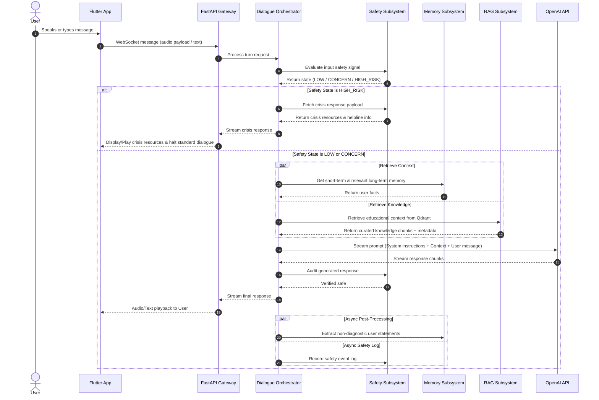
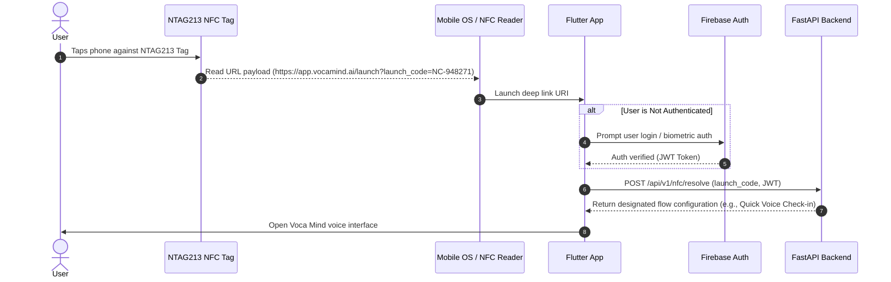

# System Architecture Specification: Voca Mind (`voca-mind`)

This document details the complete end-to-end software architecture for **Voca Mind**, a voice-based AI emotional-support and mental-health companion.

---

## 1. High-Level Architectural Principles

1. **Non-Clinical & Non-Diagnostic Framing:** System components must enforce strict boundaries. The AI companion is designed for empathetic active listening and psychoeducation, never medical diagnosis or treatment decision-making.
2. **Subsystem Isolation:** Critical pathways—especially the **Safety Subsystem** and **Personal Memory**—operate independently from standard LLM prompt generation to guarantee safety triggers and data integrity.
3. **User-Centric Data Governance:** User memory and professional data sharing require explicit, granular user consent, audit logs, and complete revocation capabilities.
4. **Voice-First Design:** Architectural components prioritize low latency across Speech-to-Text (STT), AI reasoning, Retrieval-Augmented Generation (RAG), and Text-to-Speech (TTS).

---

## 2. End-to-End System Topology

```mermaid
graph TB
    subgraph Client Layer (Mobile & Hardware)
        FlutterApp["Flutter Mobile App (iOS / Android)"]
        NFC["NTAG213 NFC Tag"]
        AudioIO["Microphone / Speaker Hardware"]
    end

    subgraph API Gateway & Authentication
        Gateway["FastAPI Gateway Router (voca_mind.api)"]
        AuthModule["Firebase Auth Verifier"]
    end

    subgraph Backend Core Services (voca_mind)
        Orchestrator["Dialogue Orchestration Service"]
        SafetyService["Dedicated Safety Subsystem"]
        MemoryService["Memory Management Service"]
        RAGService["Knowledge Retrieval Service"]
        SummaryService["Daily Summary Processor"]
        ProfService["Professional Access & Consent Service"]
    end

    subgraph Infrastructure & Persistence
        PostgreSQL[("PostgreSQL\n(Relational DB)")]
        QdrantDB[("Qdrant\n(Vector DB)")]
        RedisCache[("Redis / In-Memory\nSession Buffer")]
    end

    subgraph External Cloud Services
        OpenAI_LLM["OpenAI API (GPT-4o / Realtime)"]
        OpenAI_Embed["OpenAI Embeddings API"]
        STT_Service["STT Engine (Whisper)"]
        TTS_Service["TTS Engine (ElevenLabs / OpenAI)"]
        CrisisServices["Emergency / Crisis Hotline Routers"]
    end

    %% Flow Connections
    NFC -->|Tap / Deep Link| FlutterApp
    AudioIO <--> FlutterApp
    FlutterApp <-->|HTTPS / WSS| Gateway
    Gateway --> AuthModule
    Gateway --> Orchestrator

    Orchestrator --> SafetyService
    Orchestrator --> MemoryService
    Orchestrator --> RAGService

    SafetyService -->|Signal Evaluator| PostgreSQL
    SafetyService -->|HIGH_RISK Trigger| CrisisServices

    MemoryService <--> PostgreSQL
    MemoryService <--> RedisCache

    RAGService --> OpenAI_Embed
    RAGService <--> QdrantDB

    Orchestrator <--> OpenAI_LLM
    SummaryService --> PostgreSQL
    ProfService <--> PostgreSQL

    FlutterApp <--> STT_Service
    FlutterApp <--> TTS_Service
```

---

## 3. Major Components & Responsibilities

### 3.1 Frontend Application (`frontend/`)
- **Technology:** Flutter (Dart)
- **Responsibilities:**
  - Spoken audio capture and real-time audio streaming.
  - Spoken audio playback (TTS audio buffer management).
  - User interface for text/voice chat, daily summaries, memory management, and consent controls.
  - NTAG213 NFC tag reading and deep link payload parsing (`https://app.vocamind.ai/launch?token=...`).
  - Local authentication token storage (Firebase Auth SDK).

### 3.2 Backend API Gateway (`backend/voca_mind/api/`)
- **Technology:** Python 3.11+, FastAPI, Uvicorn
- **Responsibilities:**
  - Endpoint routing, HTTP request validation (Pydantic v2).
  - WebSocket connection handling for low-latency streaming dialogue.
  - Token validation against Firebase Auth.
  - Rate limiting, CORS management, and error handling middleware.

### 3.3 Dialogue Orchestrator (`backend/voca_mind/services/orchestrator.py`)
- **Responsibilities:**
  - Coordinates the sequence of events for every user utterance.
  - Invokes the Safety Subsystem before, during, and after LLM inference.
  - Fetches relevant short-term context, user memories, and RAG knowledge.
  - Constructs system prompts with strict safety boundaries and context separation.
  - Streams response chunks to frontend while triggering async memory extraction and summary jobs.

### 3.4 Safety Subsystem (`backend/voca_mind/safety/`)
- **Responsibilities:**
  - Independent risk signal detector (`LOW`, `CONCERN`, `HIGH_RISK`).
  - Operates deterministic pattern matching combined with lightweight classification models.
  - Bypasses standard AI conversation when `HIGH_RISK` is detected, replacing dialogue with pre-approved supportive crisis intervention messaging and crisis helpline contacts.
  - Logs all safety events for audit without storing diagnostic assertions.

### 3.5 Memory Subsystem (`backend/voca_mind/memory/`)
- **Responsibilities:**
  - Manages 5 distinct memory layers:
    1. Current conversation context (active turns buffer).
    2. Short-term memory (session summary).
    3. Daily conversation summaries.
    4. Long-term user memory (user-controlled extracted facts).
    5. Professional access snapshots.
  - Converts user utterances into non-diagnostic factual statements (e.g., `"User reported feeling exhausted"` vs. `"User has depression"`).
  - Exposes CRUD operations for user memory management.

### 3.6 Knowledge RAG Subsystem (`backend/voca_mind/rag/`)
- **Responsibilities:**
  - Manages ingestion, cleaning, semantic chunking, and embedding of curated mental-health educational material.
  - Performs hybrid/semantic vector search in Qdrant.
  - Enforces metadata tagging (title, source, review status, review date) for every retrieved chunk.
  - Strictly separates educational mental-health knowledge from individual user memory.

### 3.7 Database Layer (`backend/voca_mind/db/`)
- **Technology:** PostgreSQL, Async SQLAlchemy 2.0, Alembic
- **Responsibilities:**
  - Relational storage for users, conversations, messages, memories, daily summaries, safety events, professional access, consents, and audit logs.
  - Transactions, index management, and data integrity constraints.

### 3.8 Vector Database (`Qdrant`)
- **Responsibilities:**
  - High-performance vector storage and similarity search for curated knowledge base documents.
  - Payload filtering based on topic, document verification status, and metadata attributes.

---

## 4. Subsystem Communications & Data Flow

### 4.1 Standard Dialogue Sequence Flow



---

## 5. NFC Integration Architecture

### 5.1 Privacy Constraints
To safeguard user confidentiality, physical NTAG213 NFC tags **MUST NEVER** store:
- Personal health information or conversation logs
- Clinical notes or mental-health history
- Authentication tokens or secret keys
- Personally Identifiable Information (PII)

### 5.2 Conceptual NFC Sequence



---

## 6. Professional Access & Escalation Architecture

When a user chooses to connect with a qualified counsellor or psychiatrist, Voca Mind provides a consent-controlled sharing pipeline.

### 6.1 Architectural Rules for Professional Access
1. **Explicit Consent:** Access is turned off by default and requires active user opt-in.
2. **Limited Scope:** The user selects exact sharing scopes (e.g., Daily Summaries only, last 7 days only, or safety event history only).
3. **No Direct Database Access:** External professionals access data through a dedicated, authenticated portal querying isolated, read-only snapshot APIs.
4. **Time-Limited Grants:** Consents carry strict expiration timestamps (e.g., 30 days).
5. **Comprehensive Audit Trails:** Every access event by a professional is recorded in an immutable audit log viewable by the user.
6. **Instant Revocation:** Users can revoke access at any time, immediately invalidating professional access tokens.

---

## 7. Component Summary Matrix

| Subsystem | Primary Tech | Main Storage | Key Inputs | Key Outputs |
| :--- | :--- | :--- | :--- | :--- |
| **Mobile Frontend** | Flutter / Dart | Local Device Cache | Voice / Touch / NFC | Audio / UI Rendering |
| **API Gateway** | FastAPI | N/A | HTTP / WebSocket | JSON / WebSockets |
| **Safety Engine** | Python / Regex / ML | PostgreSQL (`safety_events`) | User Utterance | Risk Level (`LOW`/`CONCERN`/`HIGH_RISK`) |
| **Memory Engine** | Python | PostgreSQL (`memories`, `summaries`) | Dialogue History | Non-diagnostic User Facts |
| **RAG Engine** | Python / OpenAI | Qdrant Vector DB | Search Query | Educational Chunks + Source Metadata |
| **LLM Orchestrator** | Python / Asyncio | Redis (Session State) | Prompt Assembly | Streamed Dialogue Response |
