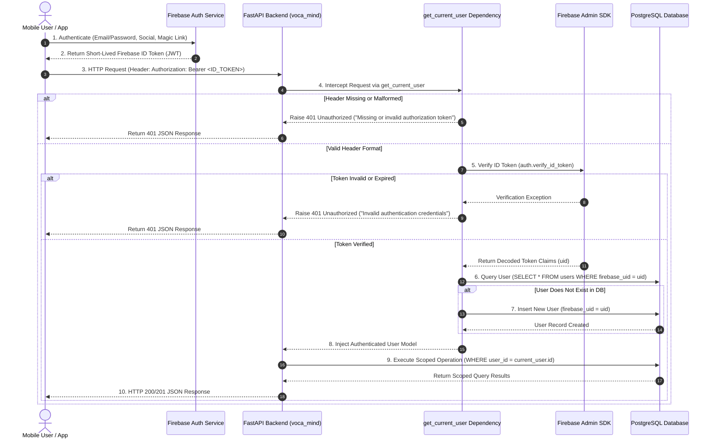

# Authentication Architecture Specification: Voca Mind (`voca-mind`)

This document specifies the authentication and user identity infrastructure for **Voca Mind**, governing how Firebase Authentication tokens are verified on the backend, mapped to internal user accounts, and used to enforce strict conversation data ownership.

---

## 1. Non-Clinical & Privacy Principles

1. **Isolation of Health Data:** Authentication identity (Firebase `uid`) strictly establishes account ownership. Authentication tokens, headers, and credentials contain **ZERO** mental-health or diagnostic data.
2. **Zero Hardcoded Credentials:** Real credentials and private keys are never committed to source control or `.env.example`. Credentials are managed exclusively via secure environment variables (`FIREBASE_PROJECT_ID`, `FIREBASE_CREDENTIALS_PATH`).
3. **Least Privilege & Ownership Scoping:** Every private resource (conversations, messages) is scoped strictly to the authenticated user's database ID (`user_id == current_user.id`). Unauthenticated or cross-user requests receive `401 Unauthorized` or `404 Not Found` responses to prevent information leakage.
4. **Security & Operational Privacy:** Firebase ID tokens, Authorization headers, passwords, and private keys are **NEVER** logged in operational logs.

---

## 2. End-to-End Authentication & Authorization Sequence



---

## 3. Core Components & Responsibilities

### 3.1 Backend Firebase Admin SDK (`backend/app/auth/firebase.py`)
- **Initialization:** Initializes Firebase Admin SDK using `FIREBASE_CREDENTIALS_PATH` or `FIREBASE_PROJECT_ID` environment settings. Supports `FIREBASE_AUTH_EMULATOR_HOST` for local emulation.
- **Verification (`verify_firebase_id_token`):** Wraps `firebase_admin.auth.verify_id_token()`. Converts verification failures into generic value errors without exposing internal stack traces.

### 3.2 FastAPI Authentication Dependency (`backend/app/auth/dependencies.py`)
- **Dependency Function (`get_current_user`):**
  - Extracts the `Authorization` header.
  - Validates `Bearer <token>` format.
  - Passes token to `verify_firebase_id_token()`.
  - Extracts Firebase `uid` from claims.
  - Queries `users` table for `firebase_uid`. If first-time login, provisions a new `User(firebase_uid=uid)` record automatically.
  - Returns the verified `User` instance for route injection.

### 3.3 Database User Model (`backend/app/models/user.py`)
- **Schema:**
  ```python
  class User(Base):
      __tablename__ = "users"

      id: Mapped[uuid.UUID] = mapped_column(PG_UUID(as_uuid=True), primary_key=True, default=uuid.uuid4)
      firebase_uid: Mapped[Optional[str]] = mapped_column(String(128), unique=True, index=True, nullable=True)
      created_at: Mapped[datetime] = mapped_column(DateTime(timezone=True), default=lambda: datetime.now(timezone.utc))
      updated_at: Mapped[datetime] = mapped_column(DateTime(timezone=True), default=lambda: datetime.now(timezone.utc))
  ```
- **Security Constraint:** Passwords are never stored on Voca Mind servers. Authentication authentication logic is delegated entirely to Firebase.

---

## 4. API Authorization & Data Ownership Enforcement

All conversation endpoints enforce strict user isolation:

1. **`POST /api/v1/conversations`**
   - User identity is derived strictly from `current_user: User = Depends(get_current_user)`.
   - Client request body payloads cannot override or supply arbitrary user IDs.
2. **`GET /api/v1/conversations/{conversation_id}`**
   - Filters database queries by `Conversation.id == conversation_id` AND `Conversation.user_id == current_user.id`.
   - Returns `404 Not Found` if the conversation belongs to another user (preventing cross-user conversation existence probing).
3. **`POST /api/v1/conversations/{conversation_id}/messages`**
   - Verifies conversation ownership before message insertion.
   - Returns `404 Not Found` if the target conversation does not belong to `current_user.id`.

---

## 5. Development & Testing Approach

### 5.1 Test Seam & Mock Verification Strategy
To allow full automated unit and integration testing without requiring real network calls or committed credentials to Firebase servers:
- **`backend/tests/conftest.py`** configures an automatic fixture (`setup_mock_firebase_auth`) that patches `verify_firebase_id_token`.
- Valid test tokens (e.g. `Bearer user-1-token`) resolve to deterministic test UIDs (`uid-user-1-token`), provisioning isolated test users on the in-memory SQLite test database.
- Tokens starting with `invalid` or containing `malformed` trigger generic `401 Unauthorized` responses matching production behavior.

---

## 6. What is Intentionally NOT Implemented Yet

1. **Frontend Authentication UI:** Mobile app login, signup, and token acquisition screens (Phase 13).
2. **Custom Claims & Role-Based Access Control (RBAC):** Admin or professional counsellor portal claims (Phase 15).
3. **Multi-Factor Authentication (MFA):** Enhanced SMS/Totp step-up authentication.
4. **AI / RAG / Voice Services:** Dialogue generation, speech engines, and vector search (Phases 5, 7, 11, 12).
