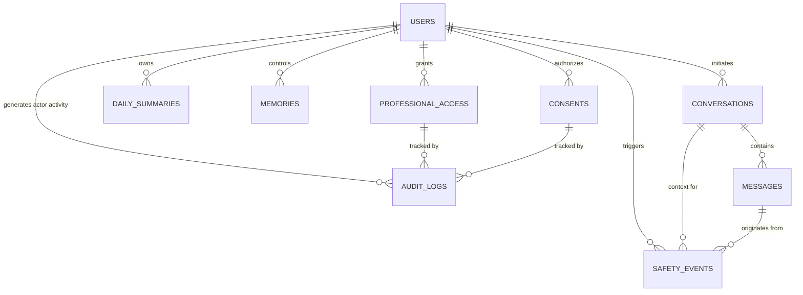

# Data Model Specification: Voca Mind (`voca-mind`)

This document defines the relational database schema, entities, field definitions, and data governance policies for **Voca Mind**.

---

## 1. Core Data Principles & Classification

To ensure user privacy, data integrity, and strict adherence to non-clinical boundaries, Voca Mind enforces explicit data classifications:

1. **Raw User Utterances:** Unaltered text/audio transcripts of user statements.
2. **Preserved Factual Reports:** Factual representations of what the user reported (e.g., `"User reported feeling exhausted"`).
3. **System Inferences:** Internal processing metadata used solely for conversation turn management (never stored as medical facts or diagnoses).
4. **Knowledge Base Documents:** Curated, approved educational mental-health content stored in Qdrant (never mixed with user data).
5. **Safety Metadata:** Event records generated by the safety subsystem (risk levels, trigger flags, crisis resource delivery).
6. **Professional Access & Consent:** Explicit, audit-logged sharing grants controlled by the user.

> [!IMPORTANT]
> **Diagnostic Guardrail:** Under no circumstances shall user statements or system inferences be converted into clinical diagnoses, psychiatric labels, or medical conditions in the database.

---

## 2. Entity-Relationship Diagram (ERD)



---

## 3. Database Schema Definitions (PostgreSQL)

### 3.1 `users` Table
Stores primary user accounts and global privacy/preference configurations.

| Column | Type | Constraints | Description |
| :--- | :--- | :--- | :--- |
| `id` | `UUID` | `PRIMARY KEY, DEFAULT gen_random_uuid()` | Unique user ID |
| `auth_provider_id` | `VARCHAR(128)` | `UNIQUE, NOT NULL` | Firebase Auth UID |
| `email` | `VARCHAR(255)` | `NULLABLE, UNIQUE` | Optional user email |
| `created_at` | `TIMESTAMPTZ` | `NOT NULL, DEFAULT NOW()` | Account creation timestamp |
| `updated_at` | `TIMESTAMPTZ` | `NOT NULL, DEFAULT NOW()` | Last account update timestamp |
| `is_active` | `BOOLEAN` | `NOT NULL, DEFAULT TRUE` | Active account status flag |
| `privacy_settings` | `JSONB` | `NOT NULL, DEFAULT '{}'` | User preference flags for memory & summary generation |

---

### 3.2 `conversations` Table
Tracks dialogue sessions between a user and Voca Mind.

| Column | Type | Constraints | Description |
| :--- | :--- | :--- | :--- |
| `id` | `UUID` | `PRIMARY KEY, DEFAULT gen_random_uuid()` | Unique conversation ID |
| `user_id` | `UUID` | `NOT NULL, REFERENCES users(id) ON DELETE CASCADE` | Associated user ID |
| `started_at` | `TIMESTAMPTZ` | `NOT NULL, DEFAULT NOW()` | Session start timestamp |
| `ended_at` | `TIMESTAMPTZ` | `NULLABLE` | Session end timestamp |
| `session_title` | `VARCHAR(255)` | `NULLABLE` | Auto-generated neutral session header |
| `status` | `VARCHAR(32)` | `NOT NULL, DEFAULT 'ACTIVE'` | `ACTIVE`, `COMPLETED`, `ESCALATED_CRISIS` |

---

### 3.3 `messages` Table
Individual dialogue turns within a conversation.

| Column | Type | Constraints | Description |
| :--- | :--- | :--- | :--- |
| `id` | `UUID` | `PRIMARY KEY, DEFAULT gen_random_uuid()` | Unique message ID |
| `conversation_id` | `UUID` | `NOT NULL, REFERENCES conversations(id) ON DELETE CASCADE` | Parent conversation |
| `sender_type` | `VARCHAR(16)` | `NOT NULL` | `USER`, `ASSISTANT`, `SYSTEM` |
| `content` | `TEXT` | `NOT NULL` | Text content of utterance |
| `audio_url` | `VARCHAR(512)` | `NULLABLE` | Secure URL to encrypted voice recording (if stored) |
| `audio_duration_sec`| `FLOAT` | `NULLABLE` | Audio duration in seconds |
| `safety_state` | `VARCHAR(16)` | `NOT NULL, DEFAULT 'LOW'` | `LOW`, `CONCERN`, `HIGH_RISK` |
| `created_at` | `TIMESTAMPTZ` | `NOT NULL, DEFAULT NOW()` | Message timestamp |

---

### 3.4 `daily_summaries` Table
Neutral, non-diagnostic daily aggregates of user interactions.

| Column | Type | Constraints | Description |
| :--- | :--- | :--- | :--- |
| `id` | `UUID` | `PRIMARY KEY, DEFAULT gen_random_uuid()` | Unique summary ID |
| `user_id` | `UUID` | `NOT NULL, REFERENCES users(id) ON DELETE CASCADE` | Associated user ID |
| `summary_date` | `DATE` | `NOT NULL` | Date of summary (YYYY-MM-DD) |
| `conversation_count`| `INTEGER` | `NOT NULL, DEFAULT 0` | Total conversations conducted on date |
| `topics_discussed` | `JSONB` | `NOT NULL, DEFAULT '[]'` | List of high-level topics (e.g., `["work stress", "sleep"]`) |
| `user_stated_concerns`| `JSONB`| `NOT NULL, DEFAULT '[]'` | Factual user-stated concerns |
| `user_stated_goals` | `JSONB` | `NOT NULL, DEFAULT '[]'` | User-stated personal goals |
| `coping_strategies` | `JSONB` | `NOT NULL, DEFAULT '[]'` | Psychoeducational strategies discussed |
| `safety_events_summary`|`JSONB` | `NOT NULL, DEFAULT '[]'` | Summary of safety events during date |
| `professional_requests`|`JSONB` | `NOT NULL, DEFAULT '[]'` | Record of professional help requests |
| `neutral_summary` | `TEXT` | `NOT NULL` | Objective narrative overview without clinical commentary |
| `created_at` | `TIMESTAMPTZ` | `NOT NULL, DEFAULT NOW()` | Summary generation timestamp |

---

### 3.5 `memories` Table
Long-term user memory tracking explicitly stated facts and user preferences.

| Column | Type | Constraints | Description |
| :--- | :--- | :--- | :--- |
| `id` | `UUID` | `PRIMARY KEY, DEFAULT gen_random_uuid()` | Unique memory ID |
| `user_id` | `UUID` | `NOT NULL, REFERENCES users(id) ON DELETE CASCADE` | Associated user ID |
| `memory_type` | `VARCHAR(32)` | `NOT NULL` | `USER_PREFERENCE`, `STATED_FACT`, `COPING_PREFERENCE` |
| `raw_user_statement`| `TEXT` | `NOT NULL` | Original user quote (e.g., `"I have been feeling exhausted."`) |
| `preserved_fact` | `TEXT` | `NOT NULL` | Non-diagnostic statement (e.g., `"User reported feeling exhausted."`) |
| `user_controlled_status`|`VARCHAR(16)`| `NOT NULL, DEFAULT 'ACTIVE'` | `ACTIVE`, `EDITED`, `DELETED` |
| `source_conversation_id`|`UUID` | `NULLABLE, REFERENCES conversations(id) ON DELETE SET NULL` | Originating conversation |
| `created_at` | `TIMESTAMPTZ` | `NOT NULL, DEFAULT NOW()` | Memory creation timestamp |
| `updated_at` | `TIMESTAMPTZ` | `NOT NULL, DEFAULT NOW()` | Last update timestamp |

#### Memory Distinction Example
```text
┌─────────────────────────────────────────────────────────────────────────────┐
│ USER STATEMENT: "I feel completely overwhelmed by my job workload."         │
├─────────────────────────────────────────────────────────────────────────────┤
│ ✅ CORRECT PRESERVED FACT: "User reported feeling overwhelmed by job."       │
│ ❌ INCORRECT / FORBIDDEN FACT: "User suffers from Major Depressive Disorder."│
└─────────────────────────────────────────────────────────────────────────────┘
```

---

### 3.6 `safety_events` Table
Audit records for safety and risk signals processed by the Safety Subsystem.

| Column | Type | Constraints | Description |
| :--- | :--- | :--- | :--- |
| `id` | `UUID` | `PRIMARY KEY, DEFAULT gen_random_uuid()` | Unique event ID |
| `user_id` | `UUID` | `NOT NULL, REFERENCES users(id) ON DELETE CASCADE` | Associated user ID |
| `conversation_id` | `UUID` | `NULLABLE, REFERENCES conversations(id) ON DELETE SET NULL` | Context conversation |
| `message_id` | `UUID` | `NULLABLE, REFERENCES messages(id) ON DELETE SET NULL` | Triggering message |
| `conceptual_state` | `VARCHAR(16)` | `NOT NULL` | `LOW`, `CONCERN`, `HIGH_RISK` |
| `triggered_signals`| `JSONB` | `NOT NULL, DEFAULT '[]'` | Triggered rule codes or safety classifiers |
| `action_taken` | `VARCHAR(64)` | `NOT NULL` | `CONTINUE_DIALOGUE`, `SOFT_GROUNDING`, `CRISIS_ESCALATION` |
| `created_at` | `TIMESTAMPTZ` | `NOT NULL, DEFAULT NOW()` | Event log timestamp |

---

### 3.7 `professional_access` Table
Grants linking users to verified counsellors or psychiatrists.

| Column | Type | Constraints | Description |
| :--- | :--- | :--- | :--- |
| `id` | `UUID` | `PRIMARY KEY, DEFAULT gen_random_uuid()` | Unique access grant ID |
| `user_id` | `UUID` | `NOT NULL, REFERENCES users(id) ON DELETE CASCADE` | Associated user ID |
| `professional_id` | `UUID` | `NOT NULL` | Unique ID of verified counsellor/psychiatrist |
| `professional_name`| `VARCHAR(255)`| `NOT NULL` | Display name of professional |
| `status` | `VARCHAR(16)` | `NOT NULL, DEFAULT 'PENDING'` | `PENDING`, `ACTIVE`, `EXPIRED`, `REVOKED` |
| `sharing_scope` | `JSONB` | `NOT NULL` | Granular scope (e.g., `["daily_summaries", "safety_logs"]`) |
| `granted_at` | `TIMESTAMPTZ` | `NOT NULL, DEFAULT NOW()` | Grant timestamp |
| `expires_at` | `TIMESTAMPTZ` | `NOT NULL` | Expiration timestamp |

---

### 3.8 `consents` Table
User consent tracking records for data sharing, analytics, and professional connections.

| Column | Type | Constraints | Description |
| :--- | :--- | :--- | :--- |
| `id` | `UUID` | `PRIMARY KEY, DEFAULT gen_random_uuid()` | Unique consent ID |
| `user_id` | `UUID` | `NOT NULL, REFERENCES users(id) ON DELETE CASCADE` | Associated user ID |
| `consent_type` | `VARCHAR(64)` | `NOT NULL` | `PROFESSIONAL_SHARING`, `SUMMARY_GENERATION`, etc. |
| `granted` | `BOOLEAN` | `NOT NULL` | `TRUE` if active, `FALSE` if revoked |
| `granted_at` | `TIMESTAMPTZ` | `NOT NULL, DEFAULT NOW()` | Granted timestamp |
| `revoked_at` | `TIMESTAMPTZ` | `NULLABLE` | Revocation timestamp |
| `scope_details` | `JSONB` | `NOT NULL, DEFAULT '{}'` | Detailed parameters of consent scope |

---

### 3.9 `audit_logs` Table
Immutable audit trail for all sensitive operations (professional data access, consent changes, safety escalations).

| Column | Type | Constraints | Description |
| :--- | :--- | :--- | :--- |
| `id` | `UUID` | `PRIMARY KEY, DEFAULT gen_random_uuid()` | Unique audit log ID |
| `actor_id` | `UUID` | `NOT NULL` | User ID or Professional ID performing action |
| `actor_type` | `VARCHAR(16)` | `NOT NULL` | `USER`, `PROFESSIONAL`, `SYSTEM_ADMIN` |
| `action` | `VARCHAR(64)` | `NOT NULL` | `READ_SUMMARY`, `GRANT_CONSENT`, `REVOKE_ACCESS`, `VIEW_SAFETY_LOG` |
| `target_resource` | `VARCHAR(255)`| `NOT NULL` | Resource URI or Entity ID accessed |
| `details` | `JSONB` | `NOT NULL, DEFAULT '{}'` | Metadata (IP address, user-agent, parameters) |
| `created_at` | `TIMESTAMPTZ` | `NOT NULL, DEFAULT NOW()` | Immutable log timestamp |
