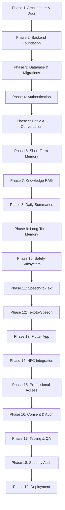

# Master Development Plan: Voca Mind (`voca-mind`)

This document outlines the 19 sequential execution phases for the development, implementation, testing, and deployment of **Voca Mind**.

---

## 🗺️ Master Phase Overview

---

## 📋 Phase Breakdown & Deliverables

### Phase 1: Architecture and Documentation
- **Status:** 🔄 In Progress / Completed
- **Objectives:** Establish complete architectural specifications, database schemas, safety models, RAG governance, security protocols, API designs, and project roadmap.
- **Key Deliverables:** `README.md`, `docs/architecture.md`, `docs/data-model.md`, `docs/rag-architecture.md`, `docs/memory-architecture.md`, `docs/safety-architecture.md`, `docs/security-and-privacy.md`, `docs/api-design.md`, `docs/development-plan.md`.
- **Verification Criteria:** All requested architectural docs created; zero application code written; zero naming inconsistencies.

---

### Phase 2: Backend Foundation
- **Objectives:** Scaffold Python FastAPI package (`voca_mind`), setup project dependencies (`pyproject.toml` / `requirements.txt`), Docker containerization, and basic health endpoints.
- **Key Deliverables:** FastAPI server skeleton, middleware, configuration management (Pydantic Settings), Docker Compose baseline.
- **Dependencies:** Phase 1 complete.

---

### Phase 3: Database and Migrations
- **Objectives:** Configure Async SQLAlchemy 2.0 models based on `docs/data-model.md` and set up Alembic migration scripts.
- **Key Deliverables:** Tables for `users`, `conversations`, `messages`, `memories`, `daily_summaries`, `safety_events`, `professional_access`, `consents`, and `audit_logs`.
- **Dependencies:** Phase 2 complete.

---

### Phase 4: Authentication
- **Objectives:** Integrate Firebase Admin Auth SDK into FastAPI middleware to validate JWT tokens and manage user identities.
- **Key Deliverables:** Auth middleware, user registration endpoint, authenticated request context injection.
- **Dependencies:** Phase 3 complete.

---

### Phase 5: Basic AI Conversation
- **Objectives:** Integrate OpenAI API for basic text-based supportive dialogue with non-clinical system instructions.
- **Key Deliverables:** Dialogue orchestrator baseline, streaming response handler, system prompt templates.
- **Dependencies:** Phase 4 complete.

---

### Phase 6: Short-Term Memory
- **Objectives:** Implement Redis/In-memory sliding window context buffer for active dialogue sessions.
- **Key Deliverables:** Session state manager, rolling context window builder.
- **Dependencies:** Phase 5 complete.

---

### Phase 7: Knowledge RAG
- **Objectives:** Setup Qdrant vector database, document cleaning/chunking scripts, OpenAI embedding generator, and knowledge search service.
- **Key Deliverables:** Ingestion script `scripts/ingest_knowledge_base.py`, Qdrant collection setup, knowledge retrieval service with metadata filtering.
- **Dependencies:** Phase 6 complete.

---

### Phase 8: Daily Summaries
- **Objectives:** Implement automated async daily summary worker compiling neutral, non-diagnostic daily aggregate reports.
- **Key Deliverables:** Daily summary generation service, `daily_summaries` DB storage, summary API endpoints.
- **Dependencies:** Phase 7 complete.

---

### Phase 9: Long-Term Memory
- **Objectives:** Implement background worker for extracting non-diagnostic user statements and storing them in the `memories` DB table with user CRUD capabilities.
- **Key Deliverables:** Memory extraction service, memory CRUD APIs, mobile memory management endpoints.
- **Dependencies:** Phase 8 complete.

---

### Phase 10: Safety Subsystem
- **Objectives:** Build dedicated Safety Subsystem evaluating `LOW`, `CONCERN`, and `HIGH_RISK` states, hard interception rules, and crisis resource routing.
- **Key Deliverables:** Safety classifier, deterministic matcher, safety middleware, emergency helpline payload generator.
- **Dependencies:** Phase 9 complete.

---

### Phase 11: Speech-to-Text (STT)
- **Objectives:** Integrate OpenAI Whisper / STT engine for converting user voice audio into text input.
- **Key Deliverables:** Audio upload endpoint, STT streaming integration, audio formatting handlers.
- **Dependencies:** Phase 10 complete.

---

### Phase 12: Text-to-Speech (TTS)
- **Objectives:** Integrate TTS synthesis engine to convert AI response streams into natural spoken audio playback.
- **Key Deliverables:** TTS audio stream synthesis engine, audio buffer manager.
- **Dependencies:** Phase 11 complete.

---

### Phase 13: Flutter Mobile Application
- **Objectives:** Build responsive Flutter application (`frontend/`) implementing voice dialogue UI, daily summary view, memory bank management, and settings.
- **Key Deliverables:** Flutter iOS/Android app, WebSocket stream client, audio recorder/player widgets.
- **Dependencies:** Phase 12 complete.

---

### Phase 14: NFC Tag Integration
- **Objectives:** Implement NTAG213 NFC tag scanning in Flutter app to launch deep link URLs (`https://app.vocamind.ai/launch?launch_code=...`) without storing sensitive data on chip.
- **Key Deliverables:** Flutter NFC plugin integration, backend `/api/v1/nfc/resolve` endpoint.
- **Dependencies:** Phase 13 complete.

---

### Phase 15: Professional / Counsellor Access
- **Objectives:** Build consent-gated professional sharing portal endpoints allowing verified counsellors to view authorized summary snapshots.
- **Key Deliverables:** Professional API endpoints, read-only data snapshot builder.
- **Dependencies:** Phase 14 complete.

---

### Phase 16: Consent and Audit System
- **Objectives:** Implement granular user consent management framework and immutable audit logging for all data accesses and revocations.
- **Key Deliverables:** Consent APIs, audit logger middleware, immutable `audit_logs` tracking.
- **Dependencies:** Phase 15 complete.

---

### Phase 17: Comprehensive Testing
- **Objectives:** Conduct end-to-end unit, integration, safety interception, and performance load tests.
- **Key Deliverables:** Automated test suite in `tests/` covering safety state triggers, memory non-diagnostic rules, and API endpoints.
- **Dependencies:** Phase 16 complete.

---

### Phase 18: Security & Privacy Review
- **Objectives:** Execute third-party penetration testing, static code analysis, key management audit, and privacy compliance validation.
- **Key Deliverables:** Security audit remediation report, vulnerability fixes.
- **Dependencies:** Phase 17 complete.

---

### Phase 19: Production Deployment
- **Objectives:** Deploy backend to cloud infrastructure (Docker, Azure/AWS), set up PostgreSQL database instance, Qdrant cluster, and release Flutter mobile app to app stores.
- **Key Deliverables:** CI/CD deployment pipelines, production monitoring, live mobile app deployment.
- **Dependencies:** Phase 18 complete.
