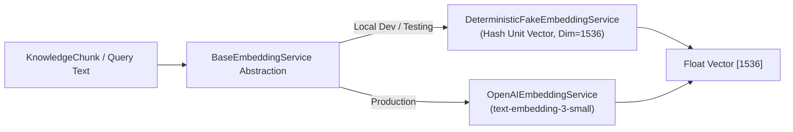
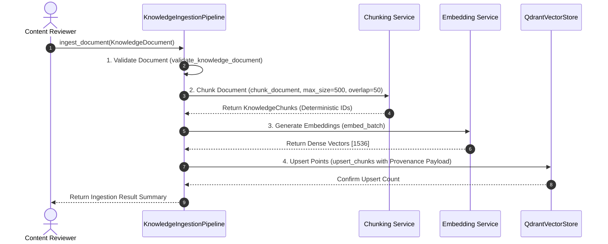
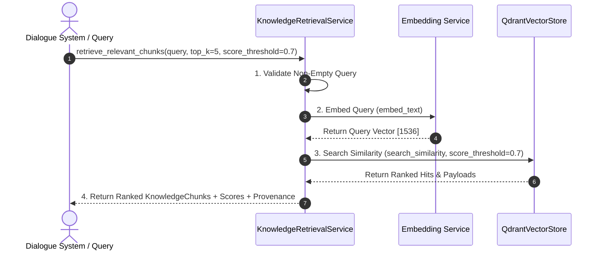

# Embeddings & Qdrant Vector Store Architecture Specification: Voca Mind (`voca-mind`)

This document specifies the design, configuration, ingestion flow, similarity search mechanics, and security boundaries for the **Embeddings & Qdrant Vector Storage System** in **Voca Mind**.

---

## ⚠️ Non-Clinical & Product Safety Boundaries

**Retrieved information from Qdrant is supporting educational context ONLY.**

- RAG knowledge retrieval does **NOT** make medical diagnoses or clinical treatment decisions.
- RAG knowledge retrieval does **NOT** recommend starting, stopping, or altering medication.
- RAG knowledge retrieval does **NOT** process individual user statements or medical patient records.
- The Safety Engine remains an independent subsystem that executes prior to and outside vector retrieval. RAG retrieval can **NEVER** override Safety Engine decisions.

---

## 1. Embedding Architecture

The embedding layer converts textual content into dense float vectors representing semantic concepts.



---

## 2. Embedding Provider Abstraction

Voca Mind defines `BaseEmbeddingService` (`backend/app/knowledge/embeddings.py`) to decouple vector generation from specific API vendors:
- **`DeterministicFakeEmbeddingService`:** Generates repeatable, deterministic float unit vectors from SHA-512 hashes. Used during automated testing and local offline development without network calls or API keys.
- **`OpenAIEmbeddingService`:** Uses OpenAI SDK `AsyncOpenAI` client targeting `text-embedding-3-small` (1536 dimensions).

---

## 3. Qdrant Architecture & Collection Configuration

- **Vector Database:** Qdrant
- **Collection Name:** `voca_mind_knowledge` (configurable via `QDRANT_COLLECTION_NAME`)
- **Vector Dimension:** 1536 (configurable via `EMBEDDING_DIMENSION`)
- **Distance Metric:** Cosine Similarity (`Distance.COSINE`)
- **Collection Lifecycle (`backend/app/knowledge/collection.py`):** `ensure_collection()` idempotently checks and creates the collection if missing. It **NEVER** drops or recreates existing collections during normal app startup.

---

## 4. End-to-End Ingestion & Retrieval Workflows

### 4.1 Ingestion Flow (`backend/app/knowledge/ingestion.py`)



### 4.2 Retrieval Flow (`backend/app/knowledge/retrieval.py`)



---

## 5. Source Provenance & Payload Schema

Every vector stored in Qdrant contains a structured payload preserving full source provenance:

```json
{
  "document_id": "doc-stress-management-01",
  "chunk_id": "doc-stress-management-01_c000",
  "chunk_index": 0,
  "text": "Deep breathing exercises activate the parasympathetic nervous system...",
  "title": "Understanding Stress Reduction Techniques",
  "source_name": "Public Health Educational Board",
  "source_url": "https://example.org/stress-reduction",
  "topic": "stress_management",
  "language": "en",
  "source_type": "educational_resource",
  "publisher": "Public Health Organization",
  "version": "1.0",
  "reviewed": true,
  "total_chunks": 3,
  "start_char": 0,
  "end_char": 482
}
```

---

## 6. Security, Privacy & Memory Separation

1. **Zero User PII in Qdrant:** The Qdrant `voca_mind_knowledge` collection stores **ONLY** reviewed, impersonal psychoeducational materials. It **NEVER** stores user IDs, Firebase UIDs, conversation IDs, user transcripts, or personal memories.
2. **Separation from User Memory:** Personal user statements are managed separately in PostgreSQL. User statements are **NEVER** written into Qdrant automatically.
3. **Secret Management:** Real API keys are never hardcoded or committed. Placeholders are specified in `backend/.env.example`.

---

## 7. Local Development vs. Hosted Qdrant Configuration

| Setting | Local Development | Hosted Qdrant Cloud |
| :--- | :--- | :--- |
| **`QDRANT_URL`** | `http://localhost:6333` | `https://<cluster_id>.qdrant.tech:6333` |
| **`QDRANT_API_KEY`** | Omitted / None | Secret API Key (from env) |
| **Embedding Provider** | `DeterministicFakeEmbeddingService` | `OpenAIEmbeddingService` |

---

## 8. Failure Handling & Production Safeguards

- **Missing Credentials:** If `ENVIRONMENT == "production"` and production keys (`QDRANT_API_KEY`, `OPENAI_API_KEY`) are missing, ingestion scripts fail explicitly with `RuntimeError` rather than silently fallback to fake vectors.
- **Collection Protection:** Ingestion and retrieval functions run `ensure_collection()`, guaranteeing collections exist without dropping existing index data.
