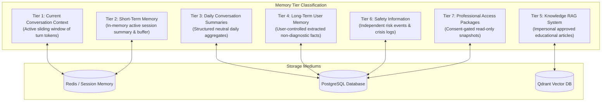
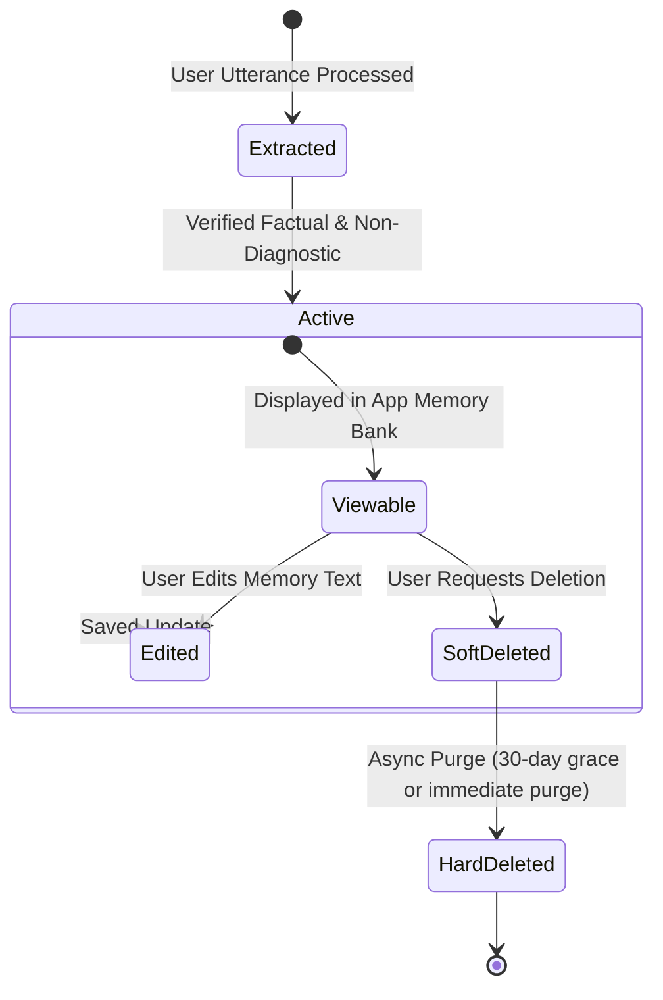

# Memory Architecture Specification: Voca Mind (`voca-mind`)

This document defines the 7-tier memory architecture of **Voca Mind**, specifying how conversational context, daily summaries, extracted long-term memories, and safety data are structured, isolated, retrieved, and managed under user control.

---

## 1. Multi-Tiered Memory Isolation Model

To guarantee user privacy, prevent context contamination, and uphold non-clinical product boundaries, Voca Mind segregates memory into 7 distinct tiers:



---

## 2. Detailed Breakdown of Memory Tiers

| Tier | Memory Scope | Retention | Storage | Primary Purpose |
| :--- | :--- | :--- | :--- | :--- |
| **1. Current Context** | Active conversation turns | Duration of session (sliding window ~10 turns) | Redis / In-Memory | Smooth, real-time dialogue flow |
| **2. Short-Term Memory** | Session-level state | Active session + 1 hour post-session | Redis Cache | Remembers topic transitions during session |
| **3. Daily Summaries** | Aggregate daily activity | Permanent until user delete request | PostgreSQL (`daily_summaries`) | High-level daily review of topics & coping skills |
| **4. Long-Term Memory** | User-stated facts & goals | Permanent under user CRUD control | PostgreSQL (`memories`) | Remembers user-stated preferences & background |
| **5. Knowledge RAG** | General educational content | Global / System-wide | Qdrant Vector DB | Grounded psychoeducational guidance |
| **6. Safety Information** | Risk logs & safety state | Audit log retention schedule | PostgreSQL (`safety_events`) | Auditability of safety actions & emergency triggers |
| **7. Professional Access**| Shared data snapshots | Expiration set by consent (e.g. 30 days) | PostgreSQL (`professional_access`) | Consent-governed sharing with human professionals |

---

## 3. Non-Diagnostic Memory Extraction Pipeline

When a user speaks or types during a session, an async background worker evaluates dialogue turns to extract factual user statements. 

### 3.1 Extraction Principles
1. **Factual Attribution:** Extract ONLY what the user explicitly stated.
2. **No Diagnostic Inferences:** Never infer psychiatric conditions, mental disorders, or diagnostic labels.
3. **No Speculative Reasoning:** Do not store speculative assumptions about the user's personality or health.

### 3.2 Concrete Examples Matrix

| User Utterance | ❌ FORBIDDEN Extracted Memory (Diagnostic) | ✅ CORRECT Extracted Memory (Factual) |
| :--- | :--- | :--- |
| *"I've been feeling so tired and unmotivated all week."* | `"User suffers from clinical depression."` | `"User reported feeling tired and unmotivated this week."` |
| *"My heart races whenever I have to give presentations at work."* | `"User has Panic Disorder / Social Anxiety."` | `"User reported experiencing a racing heart during work presentations."` |
| *"I find that going for a 15-minute evening walk helps me unwind."* | `"User prescribed walking therapy."` | `"User identified a 15-minute evening walk as a helpful unwinding routine."` |
| *"I stopped taking my vitamins yesterday."* | `"User is non-compliant with medical medication."` | `"User stated they stopped taking their vitamins yesterday."` |

---

## 4. Long-Term Memory Lifecycle & User Control

Users maintain complete control over their long-term memory via the Flutter mobile interface.



### 4.1 User Control Capabilities
- **View Memories:** Users can view a categorized list of all stored long-term memories in the app settings under `"My Memory Bank"`.
- **Edit Memories:** Users can correct or refine any preserved fact.
- **Delete Memories:** Users can delete individual memories or trigger a full wipe of all long-term memories.
- **Toggle Memory Extraction:** Users can disable automatic memory extraction entirely via privacy toggles.

### 4.2 Deletion Logic Architecture
- **Soft Deletion:** Sets `user_controlled_status = 'DELETED'` immediately removing the memory from LLM context retrieval.
- **Hard Deletion:** Permanent database record purge executed immediately or after a user-configured grace period.

---

## 5. Memory Integration into LLM Prompts

During prompt assembly, the Dialogue Orchestrator retrieves active long-term memories and formats them into a dedicated prompt section:

```text
======================================================================
USER-CONTROLLED LONG-TERM MEMORY (FACTS REPORTED BY USER)
======================================================================
- User reported feeling overwhelmed by job workload.
- User identified evening walks as a helpful coping routine.
- User expressed a goal to improve sleep consistency.

INSTRUCTIONS FOR AI ASSISTANT:
- Use these user-reported facts for personal continuity.
- Treat these as statements reported by the user, NOT medical diagnoses.
- Do NOT mention diagnostic terms or assume clinical conditions.
======================================================================
```
