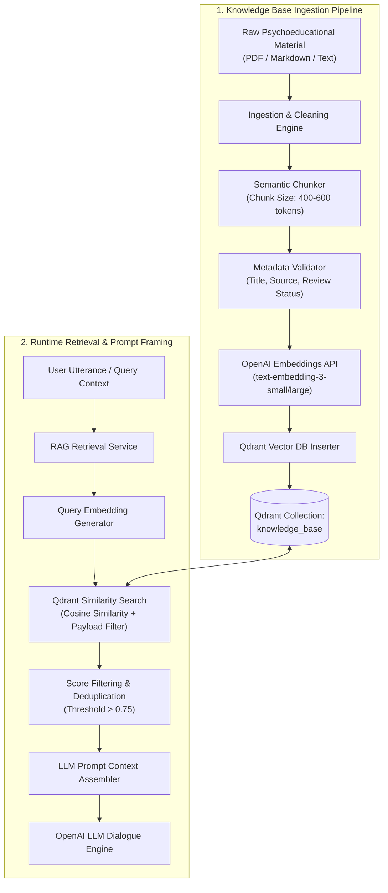
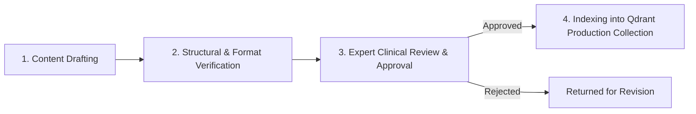

# Knowledge RAG Architecture Specification: Voca Mind (`voca-mind`)

This document describes the Retrieval-Augmented Generation (RAG) subsystem for **Voca Mind**, governing how curated mental-health knowledge is ingested, indexed, retrieved, and incorporated into AI dialogue responses.

---

## 1. Boundary Separation: Knowledge RAG vs. Personal User Memory

Voca Mind strictly separates curated educational knowledge from personal user memories:

| Architectural Dimension | Knowledge RAG | Personal User Memory |
| :--- | :--- | :--- |
| **Purpose** | Provides approved mental-health psychoeducation and coping strategies | Tracks user-stated preferences, goals, and factual statements |
| **Source** | Peer-reviewed educational resources, clinical guidelines, psychoeducational tools | Direct dialogue spoken or typed by the individual user |
| **Storage Vector / DB** | Qdrant Collection (`knowledge_base`) | PostgreSQL Tables (`memories`, `daily_summaries`) |
| **Access Control** | Global read-only across all users | Strictly scoped to individual authenticated user |
| **Diagnostic Risk** | Zero (impersonal educational concepts) | Zero (preserved non-diagnostic factual reports) |

> [!CAUTION]
> **Strict Rule:** User statements or personal memories MUST NEVER be embedded or indexed into the Knowledge RAG collection, nor treated as general medical knowledge.

---

## 2. End-to-End Ingestion & Query Pipeline



---

## 3. Knowledge Ingestion Pipeline Details

### 3.1 Document Ingestion & Cleaning
- **Location:** `knowledge_base/` directory.
- **Accepted Formats:** Markdown (`.md`), Plain Text (`.txt`), JSON (`.json`).
- **Cleaning Protocol:**
  - Strip HTML/XML formatting and non-standard characters.
  - Normalize line breaks and section headers.
  - Verify structural validity and presence of required frontmatter metadata.

### 3.2 Semantic Chunking Strategy
- **Chunk Size:** 400 – 600 tokens per chunk.
- **Overlap:** 100 tokens sliding overlap to preserve contextual continuity across boundaries.
- **Header Preservation:** Every chunk retains its parent document section header prepended to the text chunk to ensure dense vector encoding of context.

### 3.3 Vector Embedding Specification
- **Embedding Model:** OpenAI `text-embedding-3-small` (1536 dimensions) or `text-embedding-3-large` (3072 dimensions).
- **Distance Metric:** Cosine Similarity (`Distance.COSINE`).

---

## 4. Qdrant Vector Storage Schema & Metadata Standard

Every chunk stored in Qdrant contains text and metadata attributes to ensure traceability and payload filtering.

### 4.1 Document Metadata Schema (`Payload`)

```json
{
  "document_id": "kb-doc-94821",
  "chunk_id": "kb-doc-94821-c04",
  "title": "Understanding Cognitive Reframing for Daily Stress",
  "source": "Curated Psychoeducational Guidelines v1.2",
  "publisher_or_author": "Voca Mind Educational Content Board",
  "topic": "stress_management",
  "subtopics": ["cognitive_reframing", "coping_strategies"],
  "review_status": "APPROVED",
  "review_date": "2026-08-15",
  "reviewer_id": "REV-CLINICAL-402",
  "reviewer_role": "Licensed Clinical Reviewer",
  "target_audience": "General Public / Non-Clinical",
  "content_text": "Cognitive reframing involves identifying unhelpful thought patterns and considering alternative, balanced perspectives..."
}
```

### 4.2 Review Status Enum Values
- `PENDING_REVIEW`: Newly added document awaiting expert evaluation.
- `APPROVED`: Fully reviewed and approved for RAG retrieval in production.
- `REJECTED`: Document failed safety or educational guidelines; blocked from retrieval.
- `DEPRECATED`: Outdated material flagged for replacement.

---

## 5. Runtime Retrieval & Context Assembly

### 5.1 Retrieval Logic
1. **Query Construction:** Extract key emotional themes and topics from recent dialogue turns.
2. **Payload Filtering:** Filter Qdrant queries to include **ONLY** payloads with `review_status == 'APPROVED'`.
3. **Similarity Search:** Search Qdrant top-k (e.g., `k = 3`) matching vectors.
4. **Score Thresholding:** Reject retrieved chunks with a similarity score lower than `0.75`.

### 5.2 Context Construction in LLM System Prompt

Retrieved educational chunks are formatted into the system prompt with clear source framing:

```text
======================================================================
APPROVED EDUCATIONAL KNOWLEDGE (RAG CONTEXT)
======================================================================
[Source 1: "Understanding Cognitive Reframing for Daily Stress" (Approved 2026-08-15)]
"Cognitive reframing involves identifying unhelpful thought patterns..."

======================================================================
INSTRUCTIONS FOR AI ASSISTANT:
- Use the educational knowledge above to offer gentle, non-diagnostic psychoeducational insights if appropriate.
- Do NOT cite internal document IDs or technical metadata to the user.
- Do NOT present this educational information as a medical diagnosis or therapy plan.
======================================================================
```

---

## 6. Knowledge Base Governance & Review Process

To maintain content safety and quality, all knowledge base additions follow a strict 4-step governance process:



1. **Drafting:** Content compiled from validated psychoeducational literature.
2. **Technical Verification:** Format check against markdown schema, header integrity, and chunk size.
3. **Expert Review:** Review by qualified mental health professionals verifying tone, safety, accuracy, and compliance with non-clinical boundaries.
4. **Ingestion & Indexing:** Executed via automated ingestion scripts (`scripts/ingest_knowledge_base.py`) setting `review_status = 'APPROVED'`.
