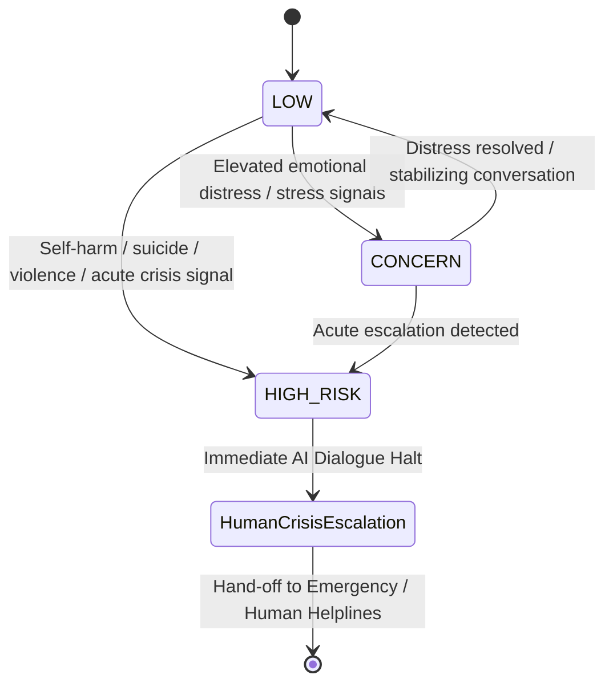
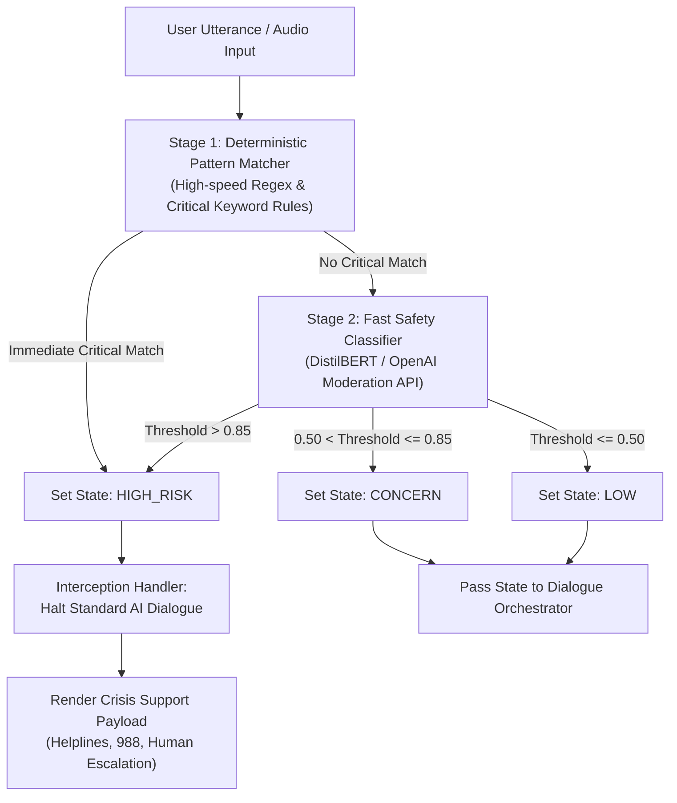
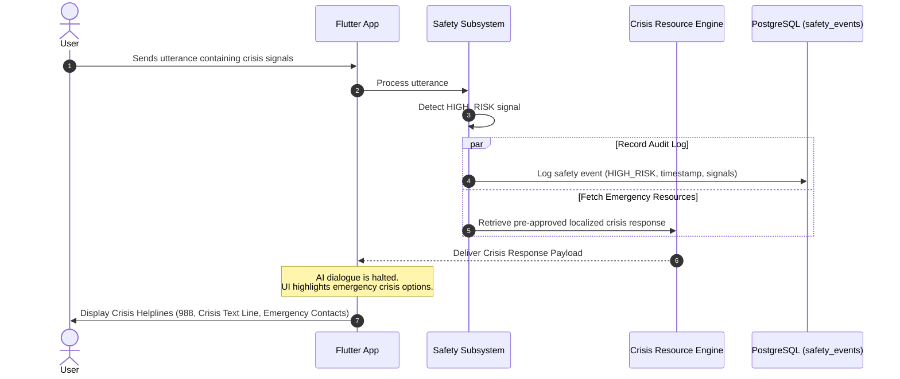

# Safety Subsystem Architecture Specification: Voca Mind (`voca-mind`)

This document details the architecture, signal processing pipeline, conceptual states, and escalation workflows of the **Dedicated Safety Subsystem** in **Voca Mind**.

---

## 1. Safety Subsystem Core Philosophy

Safety is a primary architectural requirement of Voca Mind. It is **NOT** implemented merely as a prompt instruction given to the main LLM. Instead, Safety operates as an **independent, dedicated subsystem** that monitors, audits, and intercepts conversation streams before, during, and after AI generation.

### Key Safety Principles
1. **Architectural Isolation:** The Safety Subsystem runs independently from the dialogue generator.
2. **Deterministic & Model-Based Guardrails:** Combines rapid regex/keyword pattern matching with specialized fast classifier models.
3. **Hard Interception:** High-risk detection immediately halts AI dialogue generation and replaces AI output with approved crisis support routing.
4. **Non-Clinical Policy Boundary:** Voca Mind does not invent custom clinical crisis protocols. It integrates established, official emergency resources (e.g., 988 Suicide & Crisis Lifeline, crisis text lines, local emergency contacts).

---

## 2. Conceptual Safety States

The Safety Subsystem evaluates dialogue turns and assigns one of three conceptual states:

### 2.1 State Definitions & Actions

| State | Conceptual Definition | System Behavior & Dialogue Strategy |
| :--- | :--- | :--- |
| **`LOW`** | Standard emotional expression (everyday stress, mild sadness, work frustration, general fatigue). | Standard supportive AI dialogue; active listening; psychoeducation grounding via Knowledge RAG. |
| **`CONCERN`** | Heightened emotional distress, severe anxiety, persistent insomnia, intense burnout, or feelings of deep hopelessness without acute self-harm intent. | Empathetic support framing; soft grounding exercises (e.g., deep breathing prompts); enhanced safety monitoring flag on turn stream. |
| **`HIGH_RISK`** | Expressed intent, plan, or signals of self-harm, suicide, severe harm to self/others, or acute psychological crisis. | **IMMEDIATE INTERCEPTION.** AI dialogue generation is halted. System serves verified crisis helpline information and emergency human support resources. |

---

## 3. Multi-Stage Safety Signal Processing Pipeline

Every incoming user utterance and outgoing assistant response passes through a 3-stage evaluation pipeline:

### 3.1 Pipeline Stages
1. **Stage 1: Deterministic Pattern Matcher (Latency < 5ms)**
   - Rapid evaluation of critical explicit keywords, phrases, and regex rules for self-harm and crisis.
   - If triggered, immediately flags state as `HIGH_RISK` without waiting for LLM calls.
2. **Stage 2: Fast Safety Classifier (Latency < 50ms)**
   - Specialized lightweight NLP classifier (or OpenAI Moderation API) scanning for self-harm, violence, harassment, and severe distress categories.
   - Outputs confidence scores mapped to `LOW`, `CONCERN`, or `HIGH_RISK`.
3. **Stage 3: Post-Generation Response Audit (Latency < 30ms)**
   - Scans the candidate AI response chunk before streaming to the client to ensure the AI did not generate advice regarding medication, diagnosis, or clinical treatment.

---

## 4. High-Risk Escalation & Emergency Routing Workflow

When a `HIGH_RISK` signal is triggered, the system executes an automated crisis interception workflow:

### 4.1 Crisis Support Resources Included
In `HIGH_RISK` scenarios, Voca Mind presents clear, tap-to-call resources:
- **National Crisis Lifelines:** (e.g., 988 Suicide & Crisis Lifeline in US/Canada, regional equivalents globally).
- **Crisis Text Lines:** (e.g., Text HOME to 741741).
- **Emergency Services:** Direct prompt to call local emergency services (911 / 112 / 999).
- **Designated Personal Support / Counsellor:** Option to notify a pre-connected counsellor or trusted emergency contact if configured by the user.

---

## 5. Audit Logging & Separation from Ordinary Dialogue

- Safety events are logged in the `safety_events` table with fields: `id`, `user_id`, `conversation_id`, `message_id`, `conceptual_state`, `triggered_signals`, `action_taken`, and `created_at`.
- **Privacy Assurance:** Safety logs are stored strictly for safety auditing and crisis routing. They are NEVER converted into clinical diagnoses or shared with third parties without explicit consent or legal emergency requirements.
