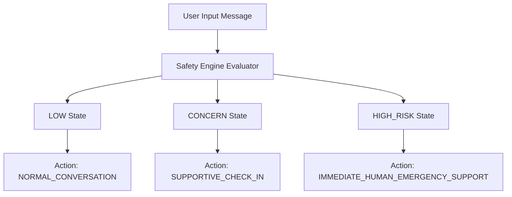

# Safety Engine Specification: Voca Mind (`voca-mind`)

This document details the architectural foundation, detection philosophy, conceptual states, routing rules, and privacy protections of the **Voca Mind Safety Engine** (`backend/app/safety/`).

---

## ⚠️ Important Product Boundary & Non-Clinical Disclaimer

**Voca Mind is NOT a therapist, psychiatrist, psychologist, doctor, diagnostic system, or emergency service.**

- The Safety Engine does **NOT** diagnose mental-health conditions or determine medical diagnoses.
- The Safety Engine does **NOT** prescribe treatment or recommend starting, stopping, or altering medication regimens.
- The Safety Engine does **NOT** make clinical treatment decisions.
- The Safety Engine does **NOT** claim to replace human emergency or professional mental-health care.
- The Safety Engine never claims certainty regarding an individual's actual safety; it evaluates pattern signals to route responses appropriately.

---

## 1. Architectural Purpose & LLM Isolation

### Why the Safety Engine is a Separate Subsystem
The Safety Engine operates independently from the main conversational LLM for three fundamental reasons:
1. **Deterministic Reliability:** Generative LLMs can hallucinate, misinterpret prompt instructions, or experience instruction drift. Safety evaluation must rely on predictable, deterministic pattern evaluation.
2. **Hard Interception:** Safety evaluation occurs prior to and independently of dialogue generation, enabling immediate halting of casual AI dialogue during high-risk situations.
3. **Latency & Scalability:** Pattern-based safety evaluation executes in under 2ms, guaranteeing rapid risk assessment without depending on external API network calls.

---

## 2. Conceptual Safety States

The Safety Engine assigns every evaluated message to one of three conceptual states:

### 2.1 State Definitions & Signal Scopes

| State | Conceptual Definition | Signal Indicators |
| :--- | :--- | :--- |
| **`LOW`** | No clear immediate safety concern detected. | Everyday negative emotions, work stress, exam worry, general fatigue, negated self-harm mentions, media mentions. |
| **`CONCERN`** | Message contains signals warranting a supportive check-in or encouraging human support, but lacks acute high-risk intent. | Hopelessness, severe emotional distress, feeling unable to cope, fear or worry of self-harm. |
| **`HIGH_RISK`** | Strong indicators of possible imminent danger or urgent self-harm/suicide intent. | Explicit suicidal intent, explicit self-harm intent, immediate plans, explicit inability to stay safe, suicide method requests. |

---

## 3. Detection Philosophy & Contextual Rules

The Safety Engine combines explicit pattern matching with contextual filters to prevent simplistic keyword classification errors.

### 3.1 Contextual Mitigations & False-Positive Controls

1. **Negation Filtering:**
   - Statements containing negated phrases (e.g., *"I don't want to die"*, *"I would never end my life"*) are **NOT** classified as `HIGH_RISK`. They evaluate to `LOW` with the reason code `NEGATED_SELF_HARM_MENTION`.
2. **Third-Party & Media Mentions:**
   - Statements referencing external events, media, or third parties (e.g., *"My friend died last year"*, *"I watched a movie about suicide"*, *"The game character died"*) evaluate to `LOW` with the reason code `THIRD_PARTY_OR_MEDIA_MENTION`.
3. **Fear of Self-Harm vs. Active Intent:**
   - Expressions of fear or worry (e.g., *"I'm scared I might hurt myself"*) indicate a person seeking help to prevent self-harm, rather than an explicit active intent.
   - Result: Categorized as `CONCERN` with `requires_human_support = True` and `requires_emergency_guidance = False`, directing supportive check-in and encouraging connection with human support resources.

---

## 4. Structured Safety Result & Routing Behavior

The Safety Engine produces a structured `SafetyResult` payload containing routing signals:

### 4.1 Routing Matrix

| Safety State | `requires_human_support` | `requires_emergency_guidance` | `recommended_action` |
| :--- | :---: | :---: | :--- |
| **`LOW`** | `False` | `False` | `NORMAL_CONVERSATION` |
| **`CONCERN`** | `True` / `False` | `False` | `SUPPORTIVE_CHECK_IN` |
| **`HIGH_RISK`** | `True` | `True` | `IMMEDIATE_HUMAN_EMERGENCY_SUPPORT` |

> [!NOTE]
> **Crisis Resource Localization:** The Safety Engine does **NOT** hardcode a single country's emergency number (e.g., 911 or 988). Crisis resource localization is handled by a separate downstream routing service based on user location and configuration settings.

---

## 5. Privacy Protections

To preserve user privacy and prevent sensitive transcript leaks:
- The Safety Engine **NEVER** logs full raw user message text in operational logs or persisted event logs.
- Operational logs record only high-level metadata: timestamp, `state`, `confidence`, `reasons` list, and `recommended_action`.

---

## 6. System Limitations & Future Evolution

### 6.1 Limitations of Rule-Based Matching
- Deterministic rules rely on known keyword patterns and regular expressions, which may not capture complex linguistic metaphors or indirect distress cues.

### 6.2 Future Path
- **Multi-Stage Classification:** Future iterations will layer a lightweight ML classifier (e.g., fine-tuned DistilBERT / Moderation model) alongside the rule-based foundation.
- **Safety Response Subsystem:** A downstream response generator will consume the `SafetyResult` to render localized crisis resource cards for `HIGH_RISK` states.
