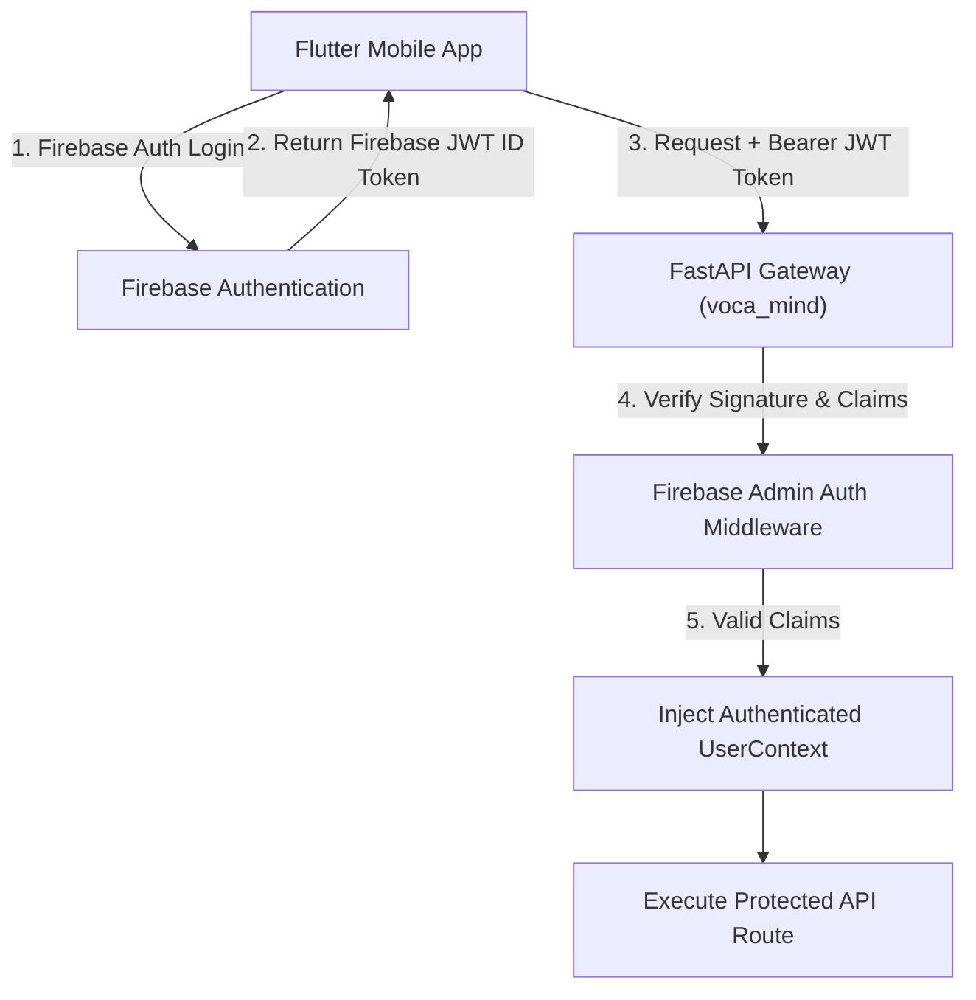
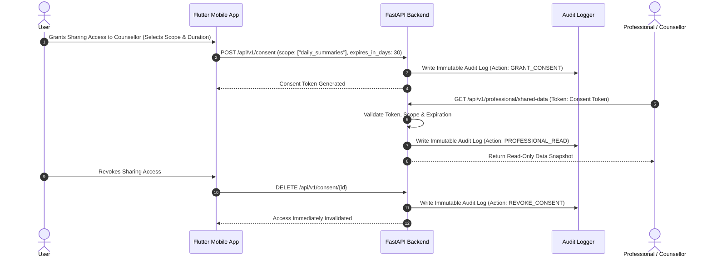

# Security & Privacy Specification: Voca Mind (`voca-mind`)

This document outlines the security architecture, data protection controls, privacy mechanisms, consent controls, and cryptographic standards for **Voca Mind**.

---

## 1. Security Architecture Principles

1. **Zero-Trust Data Protection:** All user data is encrypted in transit and at rest.
2. **Strict Data Minimization:** Collect and store only the minimum data required to deliver supportive dialogue.
3. **User Data Ownership:** Users retain complete control over memory retention, daily summary generation, and data deletion.
4. **Isolated Professional Sharing:** External healthcare professionals never receive direct database or direct API access; data sharing is mediated via time-limited, consent-gated snapshot read APIs.
5. **Physical Tag Privacy:** Physical NFC tags store zero sensitive data.

---

## 2. Authentication & Authorization Framework



### 2.1 Authentication Mechanics
- **Provider:** Firebase Authentication (supporting Email/Password, Passwordless Magic Link, Google, and Apple Sign-In).
- **Token Format:** Short-lived JSON Web Tokens (JWT) signed by Firebase Auth.
- **Backend Validation:** FastAPI middleware verifies token signature, expiration (`exp`), issuer (`iss`), and user ID (`sub`) against Firebase Admin SDK on every request.

### 2.2 Authorization & Role-Based Access Control (RBAC)
- **Roles:**
  - `ROLE_USER`: Standard mobile user accessing own dialogue, memories, and summaries.
  - `ROLE_PROFESSIONAL`: Verified external counsellor/psychiatrist accessing shared snapshot data via explicit consent grants.
  - `ROLE_ADMIN`: System admin managing knowledge base ingestion and infrastructure (zero access to unencrypted user conversations).

---

## 3. Data Encryption Standards

| Scope | Encryption Standard | Protocol / Algorithm | Implementation Location |
| :--- | :--- | :--- | :--- |
| **Data in Transit** | Encrypted Transport | TLS 1.3 / HTTPS / WSS | Gateway, WebSockets, External APIs |
| **Relational Storage** | Encryption at Rest | AES-256 (PostgreSQL Transparent Data Encryption) | PostgreSQL Storage Volumes |
| **Vector Storage** | Encryption at Rest | AES-256 Payload Encryption | Qdrant Vector Storage |
| **Audio File Storage** | Client & Server Encryption | AES-256 GCM | Cloud Blob Storage (Encrypted Buckets) |
| **Application Secrets** | Key Management | HashiCorp Vault / AWS Secrets Manager | Backend Deployment Environment |

---

## 4. Consent & Professional Access Control

Voca Mind implements an explicit, granular consent framework for sharing data with qualified professionals:



### 4.1 Professional Sharing Rules
1. **Explicit Opt-In:** Default state is strictly NO SHARING.
2. **Granular Scope Selection:** Users pick specific data categories (e.g., Daily Summaries only vs. Safety Event Logs).
3. **Time-Limited Grants:** All professional tokens feature compulsory expiration timestamps (max 30 days, renewable by user).
4. **Instant Revocation:** One-tap instant revocation invalidates all active professional tokens immediately.

---

## 5. NFC Tag Security & Privacy (NTAG213)

### 5.1 Technical Payload Restrictions
NTAG213 chips have 144 bytes of usable memory. Voca Mind enforces strict hardware payload limits:

```text
======================================================================
ALLOWED NTAG213 PAYLOAD (NDEF URI Record)
======================================================================
URL: https://app.vocamind.ai/launch?launch_code=NC-948271

======================================================================
STRICTLY FORBIDDEN ON NTAG213 TAGS
======================================================================
❌ User health data, conversation logs, or daily summaries
❌ Diagnostic reports or clinical information
❌ Authentication tokens, JWTs, or secret keys
❌ User PII (name, email, phone number, user ID)
======================================================================
```

### 5.2 NFC Tap Flow Security
1. User taps phone against physical NTAG213 tag.
2. OS reads URL `https://app.vocamind.ai/launch?launch_code=NC-948271`.
3. OS opens Voca Mind mobile application via URI Deep Linking.
4. App verifies local user authentication (prompts biometric/login if locked).
5. App calls backend `/api/v1/nfc/resolve` with authenticated user JWT and `launch_code`.
6. Backend validates `launch_code` and opens designated session interface.

---

## 6. Audit Logging Architecture

All sensitive security, privacy, and consent actions trigger immutable audit log entries:

- **Target Actions Tracked:** `GRANT_CONSENT`, `REVOKE_CONSENT`, `PROFESSIONAL_DATA_ACCESS`, `MEMORY_DELETE_ALL`, `ACCOUNT_PURGE`, `SAFETY_HIGH_RISK_TRIGGER`.
- **Log Schema:** `id`, `actor_id`, `actor_type`, `action`, `target_resource`, `ip_address`, `user_agent`, `timestamp`.
- **Tamper Resistance:** Audit logs are written to an append-only table in PostgreSQL and backed up to write-once-read-many (WORM) storage.

---

## 7. Data Retention & Right to be Forgotten

Users can initiate a complete purge of their data at any time via the Flutter app settings:

1. **Immediate Purge:** Cascading deletion wipes `users`, `conversations`, `messages`, `memories`, `daily_summaries`, and `professional_access` records.
2. **Audit Preservation:** Anonymized audit logs (with zero PII or text content) are retained for security compliance.
3. **Vector DB Isolation:** Knowledge RAG in Qdrant contains zero user data, eliminating vector re-indexing overhead during user deletion.
